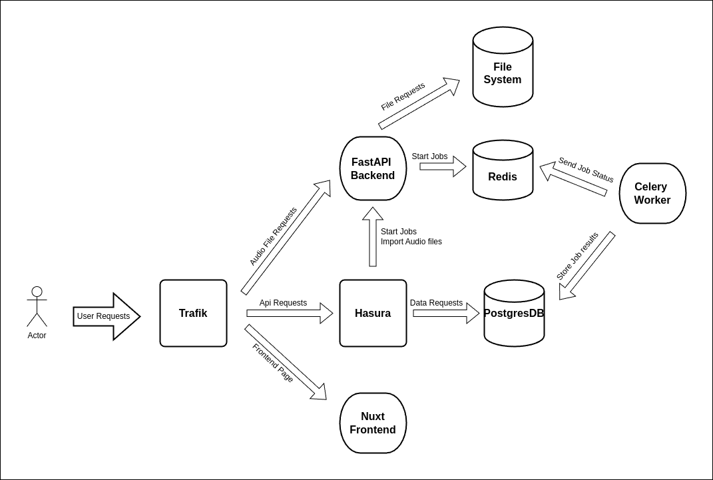

# Ecomon Monitoring Data Analysis Platform

This platform to analyze the audio monitoring data project.

## Technologies Used

1. Backend

- **[FastAPI](https://fastapi.tiangolo.com/)**: A modern, fast (high-performance), web framework for building APIs with Python 3.7+ based on standard Python type hints.
- **[SQLAlchemy](https://www.sqlalchemy.org/)**: A SQL toolkit and Object-Relational Mapping (ORM) system for Python.
- **[Celery](https://docs.celeryproject.org/en/stable/)**: A distributed task queue system for Python.
- **[Poetry](https://python-poetry.org/)**: A tool for dependency management in Python projects.

2. Frontend

- **[Node.js](https://nodejs.org/)**: A JavaScript runtime built on Chrome's V8 JavaScript engine.
- **[Nuxt.js](https://nuxtjs.org/)**: A framework for creating Vue.js applications, with a focus on server-side rendering and static site generation.
- **[Vuetify](https://vuetifyjs.com/)**: A Vue UI Library with beautifully handcrafted Material Components.

3. Infrastructure

- **[Docker](https://www.docker.com/)**: A platform for developing, shipping, and running applications in containers.
- **[PostgreSQL](https://www.postgresql.org/)**: A powerful, open-source object-relational database system.
- **[Hasura](https://hasura.io/)**: An open-source engine that connects to your databases & microservices and instantly gives you a real-time GraphQL API.
- **[Traefik](https://traefik.io/)**: A modern HTTP reverse proxy and load balancer that makes deploying microservices easy.
- **[Redis](https://redis.io/)**: An open-source, in-memory data structure store, used as a database, cache, and message broker used for communication between FastAPI and Celery.

## Architekture



## Development

For local Development you need docker, nodejs, poetry, python3.10 installed on your machine.

### Setup

1. Clone the repository
2. Start docker containers with `docker compose up -d` (this will start postgres, redis, hasura, traefik)
3. Change directory to backend and install dependencies with `poetry install --with dev`
4. copy env-default to .env and change the variables to your own
5. Update labels from csv with `poetry run update-labels-csv`
6. Run the app with `./dev-api.sh`
7. Run the worker with `./dev-worker.sh`
8. Change directory to frontend and install dependencies with `npm install`
9. copy env-default to .env and change the variables to your own
10. Run the frontend with `npm start`
11. Traefik will route http://localhost/ecomon to the frontend, http://localhost/static/files to the backend files endpoint and http://localhost/ecomon/api/v1/graphql to the hasura graphql endpoint

### Production
1. Copy production_env_default to .env and change the variables to your own a
2. To start production environment run `docker compose -f docker-compose.production.yaml up -d`
3. Import labels from csv with inside the production container 
```bash
# find api container
docker ps | grep api
# example output: 
# d150cb190c58   akwamo-webservice-next-api     ...
# attach shell to container
docker exec -it d150cb190c58 /bin/bash
# run download-labels and update-labels
poetry run download-labels && poetry run update-labels
# exit container
exit
```
