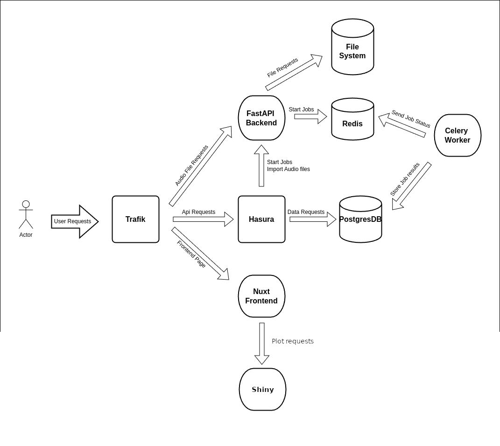

# Ecomon Monitoring Data Analysis Platform

This platform to analyze the audio monitoring data project.

## Technologies Used

1. Backend

- **[FastAPI](https://fastapi.tiangolo.com/)**: A modern, fast (high-performance), web framework for building APIs with Python 3.7+ based on standard Python type hints.
- **[SQLAlchemy](https://www.sqlalchemy.org/)**: A SQL toolkit and Object-Relational Mapping (ORM) system for Python.
- **[Celery](https://docs.celeryproject.org/en/stable/)**: A distributed task queue system for Python.
- **[Poetry](https://python-poetry.org/)**: A tool for dependency management in Python projects.
- **[Airflow](https://airflow.apache.org/)**: A workflow scheduler.

2. Frontend

- **[Node.js](https://nodejs.org/)**: A JavaScript runtime built on Chrome's V8 JavaScript engine.
- **[Nuxt.js](https://nuxtjs.org/)**: A framework for creating Vue.js applications, with a focus on server-side rendering and static site generation.
- **[Vuetify](https://vuetifyjs.com/)**: A Vue UI library
- **[Shiny](https://shiny.posit.co/)**: A data science library, used for plotting.

3. Infrastructure

- **[Docker](https://www.docker.com/)**: A platform for developing, shipping, and running applications in containers.
- **[PostgreSQL](https://www.postgresql.org/)**: A powerful, open-source object-relational database system.
- **[Hasura](https://hasura.io/)**: An open-source engine that connects to your databases & microservices and instantly gives you a real-time GraphQL API.
- **[Traefik](https://traefik.io/)**: A modern HTTP reverse proxy and load balancer that makes deploying microservices easy.
- **[Redis](https://redis.io/)**: An open-source, in-memory data structure store, used as a database, cache, and message broker used for communication between FastAPI and Celery.

## Architekture



### Celery Worker
Service for handling asynchronous jobs started in the UI. In the current setup are two worker queues.

1. **db_worker_queue** One for Data aggreation jobs like importing folders to sites and generating vouchers
2. **inference_queue** One for all inference jobs
   The amount of worker threads can be set independently


### Automation using Airflow

Additionally to the Celery worker, that is handling asynchronous jobs started in the UI, some workflows (e.g. database backups) are automated using Airflow and triggered by a scheduler. These are documented in [docs/automation.md](./docs/automation.md).

### Inferencing

Inferencing is done with the help of [BirdID-Model-Zoo](https://github.com/MfN-Berlin/BirdID-Model-Zoo).
Every inference Worker will start a BirdID-Model-Zoo container and this instance will
start the selected Model Container with the selected Parameter. The BirdID-Model-Zoo
will collect the results and transform them to the Ecomon format.

## Development
See INSTALL_DEV.md for installation of a development environment.

### Production

TL;DR;

if everything is already setup, start the production instance by running
`docker compose -f docker-compose.production.yaml up -d`

#### Setting up the production environment from scratch

1. Copy production_env_default to .env and change the variables to your own
2. To start production environment run `docker compose -f docker-compose.production.yaml up -d`
3. Import labels from csv with inside the production container

```bash
# find api container
docker ps | grep api
# example output:
# d150cb190c58   akwamo-webservice-next-api     ...
# attach shell to container
docker exec -it d150cb190c58 /bin/bash
# exit container
exit
```

**_ Prepare Inference Models _**

1. Download the model which are needed for the inference to the inferece host

```bash
# download the model
scp -r /path/to/model user@infercen-host:/path/to/model
# unzip the model
unzip model.zip
```
